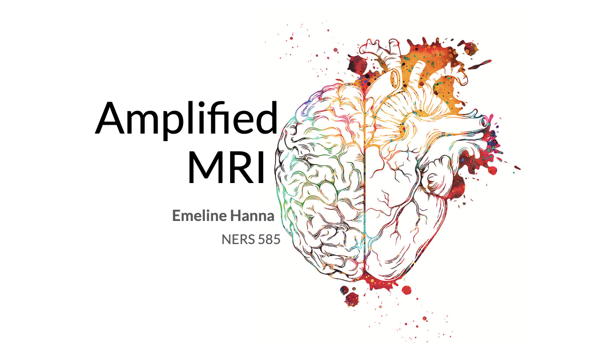
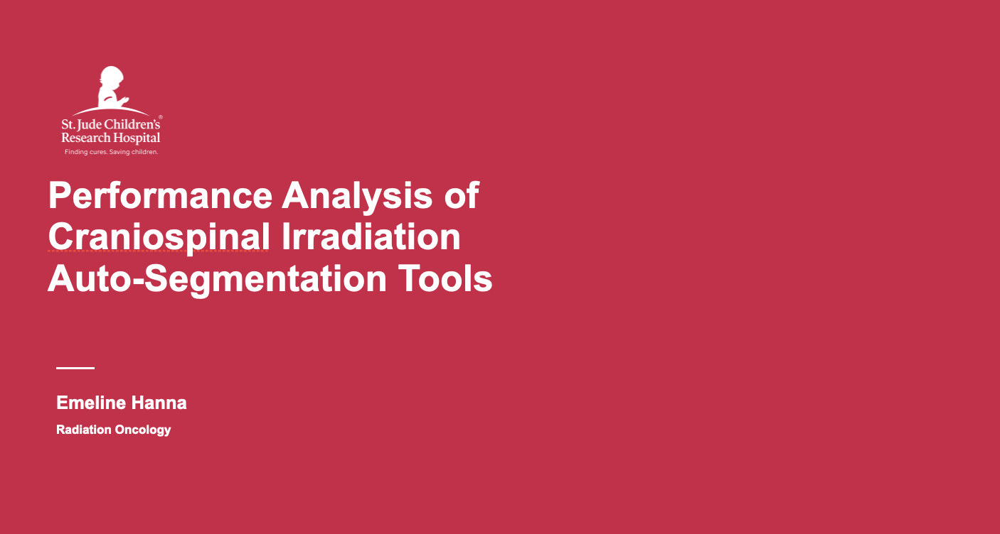

## Amplified Magnetic Resonance Imaging (aMRI)

I did a talk on Amplified Magnetic Resonance Imaging that is available below. 

    <a href="https://youtu.be/9aX548cl8bA" class="btn btn--info">Video Link</a>

This presentation was based on work done by Itamar Terem, Javid Abderezaei, and others in papers such as [3D amplified MRI (aMRI)](https://pubmed.ncbi.nlm.nih.gov/33949713/). 

## Performance Analysis of Craniospinal Irradiation Auto-Segmentation Tools

I did a talk on my work on auto-segmentation of craniospinal irradiated patients at St. Jude to the Radiation Oncology department and my fellow program participants. The slides are not currently publicly available.

